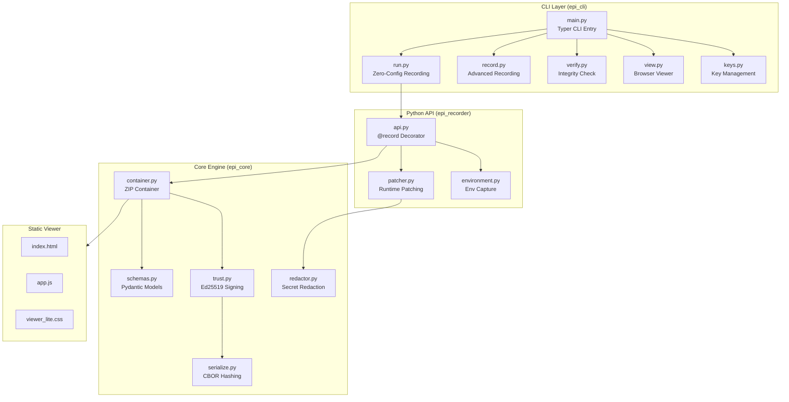
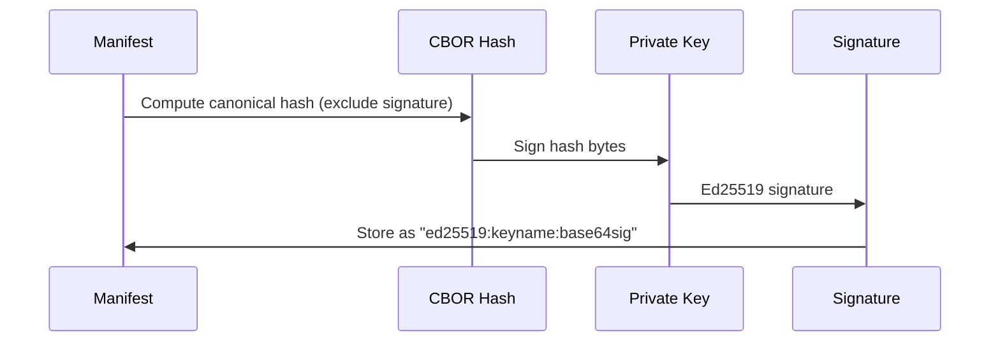
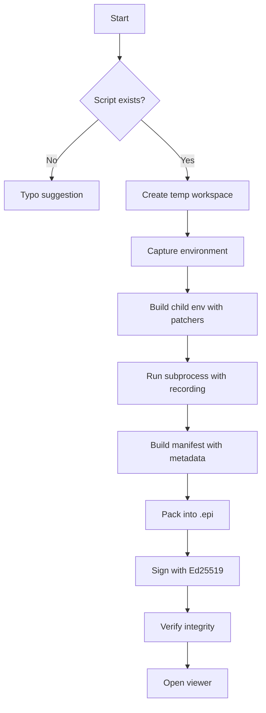

# EPI-Recorder Complete Codebase Analysis

**Project:** EPI-Recorder v2.1.1  
**Analysis Date:** December 24, 2025  
**Repository:** `c:\Users\dell\epi-recorder`

---

## Executive Summary

EPI-Recorder is a **production-ready Python tool** for creating cryptographically signed evidence packages of AI workflow executions. It functions as the "PDF for AI Evidence" - capturing code execution, API calls, file I/O, and environment state into tamper-proof `.epi` files with Ed25519 signatures.

### Key Stats
| Metric | Value |
|--------|-------|
| Version | 2.1.1 |
| Python Support | 3.11+ |
| Core Modules | 3 packages (15 Python files) |
| Test Files | 57 test modules |
| Documentation | 20+ markdown files |
| License | Apache 2.0 |

---

## Architecture Overview



---

## Package Structure

### Root Directory Files (24 dirs, 113 files)

| Category | Files |
|----------|-------|
| Config | `pyproject.toml`, `setup.py`, `MANIFEST.in` |
| Docs | `README.md`, `CHANGELOG.md`, `LICENSE`, `QUICKSTART.md`, `CHEATSHEET.md` |
| Demo Notebooks | `EPI_DEMO_demo.ipynb`, `epi_investor_demo.ipynb` |
| Build | `dist/`, `epi_recorder.egg-info/` |
| Installer | `epi_postinstall.py`, `scripts/install.ps1`, `scripts/install.sh` |

---

## 1. Core Module: `epi_core/` (6 files)

> The heart of EPI - data structures, serialization, container management, and cryptography.

### 1.1 [schemas.py](file:///c:/Users/dell/epi-recorder/epi_core/schemas.py) — Data Models

**Purpose:** Defines Pydantic models for `.epi` file structure.

#### `ManifestModel`
The global header (like PDF catalog):
```python
class ManifestModel(BaseModel):
    spec_version: str = "1.0-keystone"
    workflow_id: UUID
    created_at: datetime
    cli_command: Optional[str]
    env_snapshot_hash: Optional[str]
    file_manifest: Dict[str, str]  # filename → SHA-256 hash
    signature: Optional[str]       # Ed25519 signature
    # Metadata fields:
    goal: Optional[str]
    notes: Optional[str]
    metrics: Optional[Dict[str, Union[float, str]]]
    approved_by: Optional[str]
    tags: Optional[List[str]]
```

#### `StepModel`
Individual timeline events (stored in `steps.jsonl`):
```python
class StepModel(BaseModel):
    index: int              # Sequential step number
    timestamp: datetime     # When step occurred
    kind: str              # "llm.request", "file.write", etc.
    content: Dict[str, Any] # Step-specific data
```

**Step Types:**
- `shell.command` - CLI interactions
- `python.call` - Function traces
- `llm.request` / `llm.response` - LLM API calls
- `file.write` - File creation
- `security.redaction` - Secret scrubbing events
- `http.request` / `http.response` - Generic HTTP

---

### 1.2 [container.py](file:///c:/Users/dell/epi-recorder/epi_core/container.py) — ZIP Container (345 lines)

**Purpose:** Manages `.epi` file creation/extraction (ZIP-based format).

#### EPI File Structure
```text
example.epi (ZIP archive)
├── mimetype                    # MUST be first ("application/vnd.epi+zip")
├── manifest.json               # Metadata + signatures + hashes
├── steps.jsonl                 # Timeline (NDJSON format)
├── env.json                    # Environment snapshot
├── artifacts/                  # Captured outputs
├── viewer.html                 # Embedded offline viewer
└── cache/                      # API/LLM response cache
```

#### Key Functions

| Function | Purpose |
|----------|---------|
| `pack()` | Create `.epi` from directory - hashes files, injects viewer, writes manifest |
| `unpack()` | Extract `.epi` to directory - validates mimetype |
| `read_manifest()` | Read manifest without full extraction |
| `verify_integrity()` | Re-hash files and compare to manifest |
| `_create_embedded_viewer()` | Inject timeline data into HTML viewer |

**Mimetype Constant:** `application/vnd.epi+zip`

---

### 1.3 [trust.py](file:///c:/Users/dell/epi-recorder/epi_core/trust.py) — Cryptographic Trust (237 lines)

**Purpose:** Ed25519 digital signatures for authenticity.

#### Signing Flow


#### Key Functions

| Function | Purpose |
|----------|---------|
| `sign_manifest()` | Sign manifest with Ed25519 key |
| `verify_signature()` | Verify signature against public key |
| `sign_manifest_inplace()` | Sign manifest.json file directly |
| `get_signer_name()` | Extract key name from signature |
| `create_verification_report()` | Generate trust level report |

**Signature Format:** `ed25519:<keyname>:<base64_signature>`

**Trust Levels:**
- `HIGH` - Signed + integrity OK
- `MEDIUM` - Unsigned but integrity OK
- `NONE` - Invalid signature or integrity failure

---

### 1.4 [redactor.py](file:///c:/Users/dell/epi-recorder/epi_core/redactor.py) — Secret Redaction (280 lines)

**Purpose:** Automatically removes sensitive data from captured content.

#### Default Patterns
```python
DEFAULT_REDACTION_PATTERNS = [
    (r'sk-[a-zA-Z0-9]{48}', 'OpenAI API key'),
    (r'sk-ant-[a-zA-Z0-9_-]{95,}', 'Anthropic API key'),
    (r'AIza[a-zA-Z0-9_-]{35}', 'Google API key'),
    (r'Bearer\s+[a-zA-Z0-9_\-\.]{20,}', 'Bearer token'),
    (r'AKIA[0-9A-Z]{16}', 'AWS Access Key'),
    (r'ghp_[a-zA-Z0-9]{36}', 'GitHub PAT'),
    (r'eyJ[...JWT pattern...]', 'JWT token'),
    # + Database connection strings, PEM keys
]
```

#### Protected Environment Variables
```python
REDACT_ENV_VARS = {
    'OPENAI_API_KEY', 'ANTHROPIC_API_KEY', 'GOOGLE_API_KEY',
    'AWS_ACCESS_KEY_ID', 'AWS_SECRET_ACCESS_KEY', 'GITHUB_TOKEN',
    'API_KEY', 'SECRET_KEY', 'DATABASE_URL', 'PASSWORD', 'SECRET'
}
```

**Redaction Placeholder:** `***REDACTED***`

---

### 1.5 [serialize.py](file:///c:/Users/dell/epi-recorder/epi_core/serialize.py) — Canonical Hashing (132 lines)

**Purpose:** Deterministic CBOR serialization for tamper-evident records.

#### Key Function
```python
def get_canonical_hash(model: BaseModel, exclude_fields: set = None) -> str:
    """
    Compute SHA-256 hash using canonical CBOR encoding.
    
    Guarantees:
    - Identical hashes across Python versions/platforms
    - Key ordering independence (CBOR sorts keys)
    - Deterministic datetime/UUID encoding
    """
```

**Algorithm:**
1. Convert Pydantic model to dict
2. Normalize datetime → ISO 8601 string with "Z"
3. Normalize UUID → canonical string
4. Encode to canonical CBOR (`canonical=True`)
5. SHA-256 hash the bytes
6. Return hex digest

---

## 2. CLI Module: `epi_cli/` (9 files)

> The command-line interface built with Typer + Rich.

### 2.1 [main.py](file:///c:/Users/dell/epi-recorder/epi_cli/main.py) — Entry Point (317 lines)

**Commands Overview:**

| Command | Description |
|---------|-------------|
| `epi run <script.py>` | Zero-config: record + verify + view |
| `epi record --out <file.epi> -- <cmd>` | Advanced recording with explicit output |
| `epi verify <file.epi>` | Verify integrity and signature |
| `epi view <file.epi>` | Open browser timeline viewer |
| `epi ls` | List recordings in `./epi-recordings/` |
| `epi init` | Interactive first-time wizard |
| `epi doctor` | Self-healing diagnostics |
| `epi keys <action>` | Key management (generate/list/export) |

**First-Run Magic:**
```python
@app.callback()
def main_callback():
    # Auto-generate default keypair on first run
    generate_default_keypair_if_missing(console_output=True)
```

---

### 2.2 [run.py](file:///c:/Users/dell/epi-recorder/epi_cli/run.py) — Zero-Config Recording (397 lines)

**The flagship command** - designed for maximum ease:

```bash
epi run my_script.py
# → Creates: ./epi-recordings/my_script_20251224_193000.epi
# → Verifies: OK
# → Opens: Browser viewer
```

#### Smart UX Features

1. **Interactive Mode** - If no script specified, shows file picker
2. **Typo Fixer** - Suggests close matches for misspelled filenames
3. **Auto-Key Generation** - Creates signing keys if missing
4. **Environment Capture** - Records Python version, packages, env vars
5. **Auto-Sign** - Signs with default key automatically
6. **Auto-Verify** - Validates integrity before opening

#### Recording Flow


#### Metadata Options
```bash
epi run script.py \
  --goal "Test model accuracy" \
  --notes "Switched to GPT-4" \
  --metric accuracy=0.92 \
  --metric latency=210 \
  --approved-by "alice@company.com" \
  --tag "prod-candidate"
```

---

### 2.3 [keys.py](file:///c:/Users/dell/epi-recorder/epi_cli/keys.py) — Key Management (273 lines)

**Purpose:** Ed25519 keypair management stored in `~/.epi/keys/`

#### KeyManager Class
```python
class KeyManager:
    def __init__(self, keys_dir=None):
        self.keys_dir = keys_dir or Path.home() / ".epi" / "keys"
    
    def generate_keypair(name, overwrite=False) -> (Path, Path)
    def load_private_key(name) -> Ed25519PrivateKey
    def load_public_key(name) -> bytes  # Raw 32 bytes
    def list_keys() -> List[dict]
    def export_public_key(name) -> str  # Base64
    def has_key(name) -> bool
```

**File Permissions:**
- Private keys: `0600` (owner read/write only)
- Public keys: `0644` (world readable)

---

### 2.4 [verify.py](file:///c:/Users/dell/epi-recorder/epi_cli/verify.py) — Verification (220 lines)

**Three-Level Verification:**

1. **Structural** - ZIP format, mimetype, manifest schema
2. **Integrity** - Re-hash files, compare to manifest
3. **Authenticity** - Ed25519 signature validation

```bash
epi verify demo.epi --verbose
# Step 1: Structural Validation
#   ✓ Valid ZIP format
#   ✓ Valid mimetype
#   ✓ Valid manifest schema
# Step 2: Integrity Checks
#   ✓ All 15 files verified
# Step 3: Authenticity Checks
#   ✓ Signature valid (key: default)
```

---

## 3. Python API: `epi_recorder/` (7 files)

> The library interface for programmatic recording.

### 3.1 [api.py](file:///c:/Users/dell/epi-recorder/epi_recorder/api.py) — Python API (593 lines)

**Two Usage Patterns:**

#### Context Manager
```python
from epi_recorder import record

with record("output.epi", goal="Test accuracy"):
    response = openai.chat.completions.create(...)
    # All API calls are captured automatically
```

#### Decorator
```python
from epi_recorder import record

@record(goal="Production run", metrics={"version": "1.0"})
def my_workflow():
    # Function body is recorded
    pass
```

#### EpiRecorderSession Class
```python
class EpiRecorderSession:
    def __init__(
        self,
        output_path: Path,
        workflow_name: str = None,
        auto_sign: bool = True,
        redact: bool = True,
        # Metadata:
        goal: str = None,
        notes: str = None,
        metrics: Dict = None,
        approved_by: str = None,
    ): ...
    
    def log_step(kind: str, content: dict)
    def log_llm_request(model: str, payload: dict)
    def log_llm_response(payload: dict)
    def log_artifact(file_path: Path)
```

---

### 3.2 [patcher.py](file:///c:/Users/dell/epi-recorder/epi_recorder/patcher.py) — Runtime Patching (438 lines)

**Purpose:** Monkey-patches LLM libraries to intercept API calls.

#### Patched Libraries

| Library | Method | Version |
|---------|--------|---------|
| OpenAI | `chat.completions.create` | v1+ (client API) |
| OpenAI | `ChatCompletion.create` | v0.x (legacy) |
| Requests | `Session.request` | All versions |

#### Recording Context
```python
class RecordingContext:
    def __init__(self, output_dir: Path, enable_redaction: bool = True):
        self.output_dir = output_dir
        self.redactor = get_default_redactor()
        self.steps_file = output_dir / "steps.jsonl"
    
    def add_step(kind: str, content: dict):
        # 1. Redact secrets if enabled
        # 2. Create StepModel
        # 3. Write to steps.jsonl (append)
```

#### OpenAI v1 Patch
```python
def _patch_openai_v1():
    from openai.resources.chat import completions
    original_create = completions.Completions.create
    
    @wraps(original_create)
    def wrapped_create(self, *args, **kwargs):
        if not is_recording():
            return original_create(self, *args, **kwargs)
        
        context = get_recording_context()
        # Log request
        context.add_step("llm.request", {...})
        # Execute
        response = original_create(self, *args, **kwargs)
        # Log response
        context.add_step("llm.response", {...})
        return response
    
    completions.Completions.create = wrapped_create
```

---

### 3.3 [environment.py](file:///c:/Users/dell/epi-recorder/epi_recorder/environment.py) — Environment Capture (238 lines)

**Captures:**
- OS info (system, release, version, machine)
- Python info (version, implementation, executable)
- Installed packages (via `importlib.metadata`)
- Environment variables (with redaction)
- Working directory

**Safe Env Vars (captured by default):**
```python
SAFE_ENV_VARS = {
    "PATH", "PYTHONPATH", "HOME", "USER", "SHELL",
    "LANG", "VIRTUAL_ENV", "CONDA_DEFAULT_ENV"
}
```

---

## 4. Static Viewer: `epi_viewer_static/` (3 files)

> Self-contained HTML/CSS/JS viewer embedded in every `.epi` file.

### Files

| File | Size | Purpose |
|------|------|---------|
| [index.html](file:///c:/Users/dell/epi-recorder/epi_viewer_static/index.html) | 3.3 KB | HTML template with data placeholder |
| [app.js](file:///c:/Users/dell/epi-recorder/epi_viewer_static/app.js) | 13 KB | Timeline rendering, step display |
| [viewer_lite.css](file:///c:/Users/dell/epi-recorder/epi_viewer_static/viewer_lite.css) | 4.7 KB | Offline CSS (no CDN dependencies) |

### Key Features
- **100% Offline** - No external dependencies or CDN
- **XSS Protection** - HTML escaping for all content
- **Trust Badge** - Shows signature status
- **Timeline** - Interactive step navigation
- **LLM Visualization** - Special rendering for request/response

---

## 5. Test Infrastructure: `tests/` (57 files)

> Comprehensive pytest-based test suite.

### Test Categories

| Category | Files | Purpose |
|----------|-------|---------|
| Container | `test_container.py` (366L, 28 tests) | ZIP packing/unpacking |
| Trust | `test_trust.py` (16.6K) | Ed25519 signing |
| Redactor | `test_redactor.py` (10.2K) | Secret detection |
| Serialize | `test_serialize.py` (9.8K) | CBOR hashing |
| API | `test_api.py` (14.6K) | Python API |
| CLI | `test_cli_*.py` (multiple) | Command tests |
| E2E | `REAL_USER_TEST.py`, `ULTIMATE_COMPLETE_TEST.py` | Full workflow |

### Test Configuration (pyproject.toml)
```toml
[tool.pytest.ini_options]
testpaths = ["tests"]
addopts = "-v --cov=epi_core --cov=epi_cli --cov-report=term-missing"
```

---

## 6. Installation & Deployment

### Package Configuration

```toml
[project]
name = "epi-recorder"
version = "2.1.1"
requires-python = ">=3.11"

dependencies = [
    "pydantic>=2.0.0",
    "cryptography>=41.0.0",
    "cbor2>=5.6.0",
    "typer[all]>=0.12.0",
    "rich>=13.0.0",
]

[project.scripts]
epi = "epi_cli.main:app"
```

### Installation Methods

1. **Universal Scripts:**
   ```bash
   # Unix/Mac
   curl -sSL https://raw.githubusercontent.com/mohdibrahimaiml/EPI-V2.1.0/main/scripts/install.sh | sh
   
   # Windows
   iwr https://raw.githubusercontent.com/mohdibrahimaiml/EPI-V2.1.0/main/scripts/install.ps1 -useb | iex
   ```

2. **Pip:**
   ```bash
   pip install epi-recorder
   ```

3. **Fallback (always works):**
   ```bash
   python -m epi_cli run script.py
   ```

---

## 7. Security Analysis

### Cryptographic Implementation

| Component | Algorithm | Library |
|-----------|-----------|---------|
| Signing | Ed25519 | `cryptography.hazmat` |
| Hashing | SHA-256 | `hashlib` |
| Serialization | CBOR (RFC 8949) | `cbor2` |

### Security Features

1. **Tamper Detection** - Any file modification invalidates signature
2. **Secret Redaction** - 15+ regex patterns for API keys/tokens
3. **Secure Key Storage** - `0600` permissions on private keys
4. **No Network** - Viewer works 100% offline

### Potential Concerns

- Private keys stored **unencrypted** (acceptable for MVP)
- No key rotation mechanism yet
- No revocation system

---

## 8. Version History

| Version | Date | Key Changes |
|---------|------|-------------|
| 2.1.1 | 2025-12-16 | PATH auto-fix, `epi doctor`, Windows Unicode fixes |
| 2.1.0 | 2025-12-XX | Zero-config `epi run`, offline viewer, init wizard |
| 2.0.0 | 2025-12-01 | Production MVP release |
| 1.0.0 | 2025-01-29 | "Keystone" draft spec |

---

## Summary

EPI-Recorder is a **well-architected, production-quality** tool with:

- ✅ **Clean separation** - Core/CLI/API modules
- ✅ **Modern Python** - Pydantic, Typer, Rich, type hints
- ✅ **Strong cryptography** - Ed25519, SHA-256, CBOR
- ✅ **Comprehensive testing** - 57 test files
- ✅ **Security-first** - Automatic secret redaction
- ✅ **User-friendly** - Zero-config mode, auto-fix features
- ✅ **Well-documented** - README, specs, CLI help

The codebase demonstrates professional software engineering practices and is suitable for regulatory/compliance use cases in finance, healthcare, and research.
