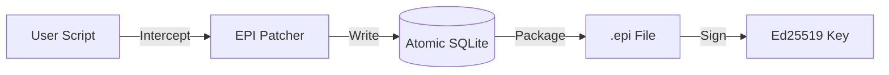

<p align="center">
  
  <br>
  <h1 align="center">EPI Recorder</h1>
</p>

[](https://github.com/mohdibrahimaiml/epi-recorder/releases)
[](https://pypi.org/project/epi-recorder/)
[](LICENSE)
[](https://pypi.org/project/epi-recorder/)

**The Flight Recorder for AI Agents**
*Like a PDF for AI Evidence*

Debug production failures in LangChain, CrewAI, and custom agents with one command.
Captures complete execution context—prompts, responses, tool calls—and cryptographically seals them for verification.

---

## Table of Contents

- [Quick Start](#quick-start)
- [Why EPI?](#why-epi)
- [Features](#features)
- [CLI Reference](#cli-reference)
- [Python API](#python-api)
- [File Format Specification](#file-format-specification)
- [How It Works](#how-it-works)
- [Security](#security)
- [Release History](#release-history)
- [Contributing](#contributing)
- [License](#license)

---

## Quick Start

```bash
pip install epi-recorder

# Record your agent (zero config)
epi run agent.py

# View the recording (opens browser)
epi view recording.epi

# Verify integrity (cryptographic proof)
epi verify recording.epi
```

---

## Why EPI?

Your AI agent failed in production. It hallucinated. It looped infinitely. It cost you $50 in API calls.

**You can't reproduce it.** LLMs are non-deterministic. Your logs don't show the full prompt context. You're taking screenshots and pasting JSON into Slack.

**EPI is the black box.** One command captures everything. Debug locally. Prove what happened.

---

## Features

| Feature | Description |
|:---|:---|
| **⚡ Zero Config** | `epi run` intercepts OpenAI, Gemini, LangChain, CrewAI automatically—no code changes. |
| **🔍 Debug Tools** | `epi debug` analyzes recordings for loops, hallucinations, and inefficiencies. |
| **🛡️ Crash Safe** | Atomic SQLite storage survives OOM and power failures. |
| **🔐 Tamper Proof** | Ed25519 signatures prove logs weren't edited. |
| **🌐 Framework Agnostic** | Works with any Python agent. |
| **♊ Gemini Native** | Automatic interception of `google.generativeai` calls. |
| **🧵 Thread-Safe** | Uses `contextvars` for concurrent agent support. |
| **⚡ Async Support** | Native `async/await` support for modern frameworks. |

---

## CLI Reference

### Core Commands

| Command | Description |
|:---|:---|
| `epi init` | Interactive Setup Wizard. Creates keys, runs a demo. |
| `epi run <script.py>` | Zero-Config Record. Records, verifies, and views in one go. |
| `epi debug <file.epi>` | AI Bug Detection. Finds loops, hallucinations, inefficiencies. |
| `epi view <file.epi>` | Open Viewer. Opens the browser timeline for a recording. |
| `epi verify <file.epi>` | Check Integrity. Validates signatures and hashes. |
| `epi chat <file.epi>` | AI Chat. Query your evidence using Google Gemini. |
| `epi ls` | List Recordings. Shows files in `./epi-recordings/`. |
| `epi doctor` | Self-Healing. Fixes common environment issues. |

### Examples

```bash
# Record with specific filename
epi record --out experiment_1.epi -- python agent.py

# Verify with verbose output
epi verify --verbose demo.epi

# Debug to find agent bugs
epi debug agent_session.epi

# Chat with your evidence (requires GOOGLE_API_KEY)
epi chat my_run.epi
```

### Key Management

| Command | Description |
|:---|:---|
| `epi keys list` | Show all keys in `~/.epi/keys/`. |
| `epi keys generate` | Create a new Ed25519 keypair. |
| `epi keys export --name <k>` | Export public key for verification elsewhere. |

---

## Python API

For deeper integration, import `epi_recorder` in your code.

```python
from epi_recorder import record

# Method 1: Decorator
@record(goal="Test Model Accuracy")
def main():
    # Your agent code here
    ...

# Method 2: Context Manager
with record("my_evidence.epi"):
    agent.run()
```

---

## File Format Specification

### Overview

`.epi` files are **ZIP archives** containing cryptographically verifiable AI execution logs.

**MIME Type:** `application/epi+zip`

### Container Structure

```text
example.epi (ZIP archive)
├── mimetype                    # "application/epi+zip" (MUST be first)
├── manifest.json               # Metadata + signatures + hashes
├── steps.jsonl                 # Timeline (NDJSON format)
├── env.json                    # Environment snapshot
├── artifacts/                  # Content-addressed outputs
│   └── sha256_<hash>
└── viewer/                     # Embedded Offline Viewer
    ├── index.html
    └── viewer_lite.css
```

### Manifest Schema

The `manifest.json` is the source of truth for the package:

```json
{
  "spec_version": "1.1-json",
  "workflow_id": "uuid...",
  "created_at": "iso-8601...",
  "cli_command": "epi run script.py",
  "env_snapshot_hash": "sha256...",
  "file_manifest": {
    "steps.jsonl": "sha256...",
    "env.json": "sha256..."
  },
  "signature": "ed25519:<base64_signature>"
}
```

### Step Types

The `steps.jsonl` file uses Newline-Delimited JSON with these event types:

| Type | Description |
|:---|:---|
| `llm.request` | Outgoing LLM API call (prompt, model, parameters) |
| `llm.response` | Incoming LLM response (text, token usage) |
| `python.call` | Function traces |
| `file.write` | File creation events |
| `security.redaction` | Documented scrubbing of secrets |

### Verification Algorithm

1. **Structural Check:** Unzip and validate manifest existence.
2. **Integrity Check:** Re-hash all files and compare with `file_manifest`.
3. **Authenticity Check:** Verify Ed25519 signature using public key.

---

## How It Works

EPI injects instrumentation at the Python runtime level via `sitecustomize.py`.

1. **Intercept**: Captures LLM calls at the HTTP layer and library level.
2. **Store**: Atomic SQLite WAL ensures data safety on crashes.
3. **Analyze**: `epi debug` uses heuristics to find root causes.
4. **Seal**: Ed25519 signatures create verifiable evidence.



### Supported Libraries

| Library | Support |
|:---|:---|
| OpenAI | ✅ Full (chat, completions) |
| Google Gemini | ✅ Full (generativeai) |
| LangChain | ✅ Via HTTP interception |
| CrewAI | ✅ Via HTTP interception |
| Anthropic | ✅ Via HTTP interception |
| Any HTTP | ✅ Via `requests.Session` patching |

---

## Security

EPI provides cryptographic infrastructure for verifiable AI logging:

| Feature | Implementation |
|:---|:---|
| **Signatures** | Ed25519 with client-side verification |
| **Hashing** | SHA-256 for content integrity |
| **Serialization** | Canonical CBOR for deterministic hashing |
| **Redaction** | Automatic API key and secret removal |
| **Offline** | Air-gapped operation, no cloud required |

---

## Release History

| Version | Date | Highlights |
|:---|:---|:---|
| **v2.2.0** | 2026-01-30 | Agent Debugging, SQLite Storage, Thread-Safe, MIT License, Async |
| **v2.1.3** | 2026-01-24 | Gemini Support, `epi chat` command |
| **v2.1.2** | 2026-01-17 | Client-Side Verification |
| **v2.1.1** | 2025-12-16 | Installation Fixes, `epi doctor` |
| **v2.1.0** | 2025-12-15 | Initial Release |

---

## Contributing

We welcome contributions! Please see [CONTRIBUTING.md](./CONTRIBUTING.md) for details.

```bash
git clone https://github.com/mohdibrahimaiml/epi-recorder.git
cd epi-recorder
pip install -e ".[dev]"
pytest
```

---

## License

MIT License. See [LICENSE](./LICENSE) for details.
